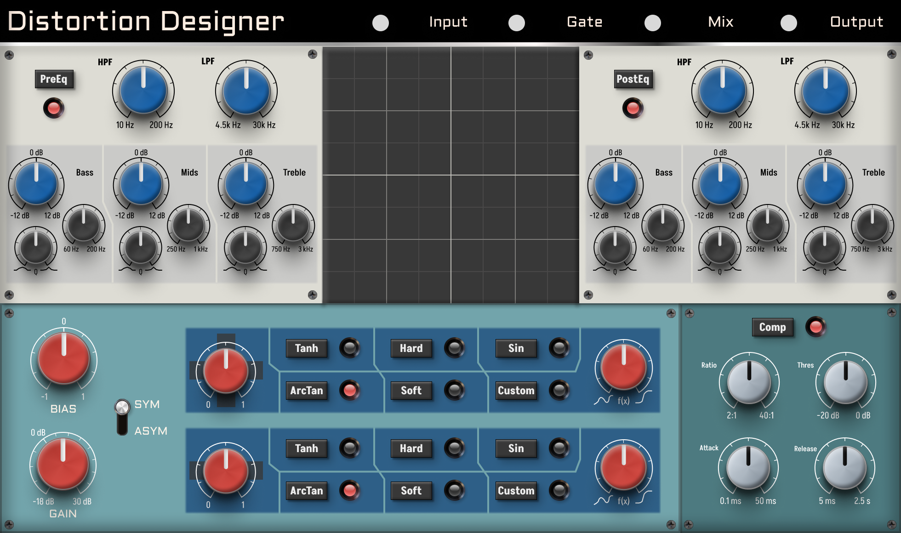

# Distortion designer

I am developing this audio plugin to further my understanding and knowledge of DSP and digital audio effects. My main objective is to create a tool that helps me get the values I want to use in my other overdrive/distortion modules.

*Warning: I still have a lot to work on and haven't decided to write a decent README.*

## Signal path

My signal path is a basic chain to emulate the distortion of guitar amplifiers. I may revisit this chain when I get a better understanding of the whole idea.

I suggest checking out both [1] and [2] to get an idea of the process.

**Signal path:** Input gain &rarr Noise gate &rarr PreEQ &rarr Distortion section &rarr Compression section &rarr PostEQ &rarr Mix &rarr Output gain

## Waveshaping functions

At some point I will put the mathematical formulas/graphs of how every single waveshaping function works.

## TODO list

* Positive / Negative corrections don't work ??

* UI function buttons aren't attached correctly to the processor's parameters.

* The graph in the middle should display the waveshaping that is being applied to the signal.

* I want the `Custom` function to be a ComboBox where you can actually select different functions and then the f(x) knob will modify the waveshaper in a different way.

* Update this README, of course...

## References & Inspiration

### CMake and JUCE

* This project has been created with Sudara's [Pamplejuce template](https://github.com/sudara/pamplejuce/tree/main), you should see his [blog](https://melatonin.dev/blog/how-to-use-cmake-with-juce/).
* [Effective Modern CMake](https://gist.github.com/mbinna/c61dbb39bca0e4fb7d1f73b0d66a4fd1)
* JUCE's announcement of [native CMake support](https://forum.juce.com/t/native-built-in-cmake-support-in-juce/38700)
* [Eyalamir Music's JUCE / CMake prototype repository](https://github.com/eyalamirmusic/JUCECmakeRepoPrototype)

### Distortion theory

* [1]: <https://www.fractalaudio.com/downloads/manuals/axe-fx-2/Fractal-Audio-Systems-MIMIC-(tm)-Technology.pdf> "Fractal Audio Systems whitepaper on guitar tone"
* [2]: <https://www.ampbooks.com/mobile/dsp/preamp/> "Digital modeling of guitar amplifier preamp distortion"
