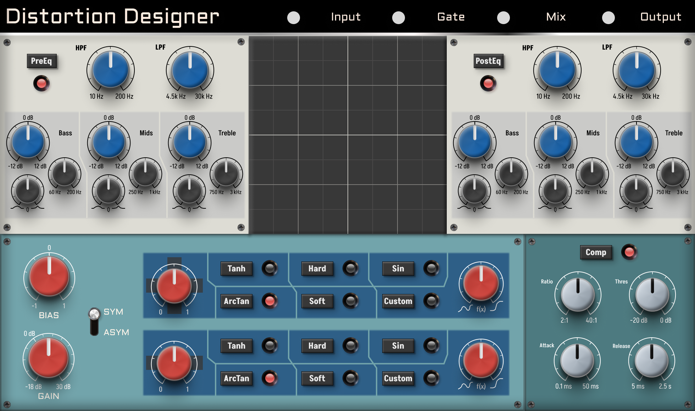

# Distortion designer

I am developing this audio plugin in order to facilitate the study and modelling of overdrive and distortion effects. If you are not reading anything else, that means that I still have a lot to work on and haven't decided to write a decent README.

## References & Inspiration

### CMake and JUCE

* This project has been created with Sudara's [Pamplejuce template](https://github.com/sudara/pamplejuce/tree/main), you should see his [blog](https://melatonin.dev/blog/how-to-use-cmake-with-juce/).
* [Effective Modern CMake](https://gist.github.com/mbinna/c61dbb39bca0e4fb7d1f73b0d66a4fd1)
* JUCE's announcement of [native CMake support](https://forum.juce.com/t/native-built-in-cmake-support-in-juce/38700)
* [Eyalamir Music's JUCE / CMake prototype repository](https://github.com/eyalamirmusic/JUCECmakeRepoPrototype)

### Distortion theory

* [Digital modeling of guitar amplifier preamp distortion](https://www.ampbooks.com/mobile/dsp/preamp/).
* [Fractal Audio Systems whitepaper on guitar tone](https://www.fractalaudio.com/downloads/manuals/axe-fx-2/Fractal-Audio-Systems-MIMIC-(tm)-Technology.pdf).
